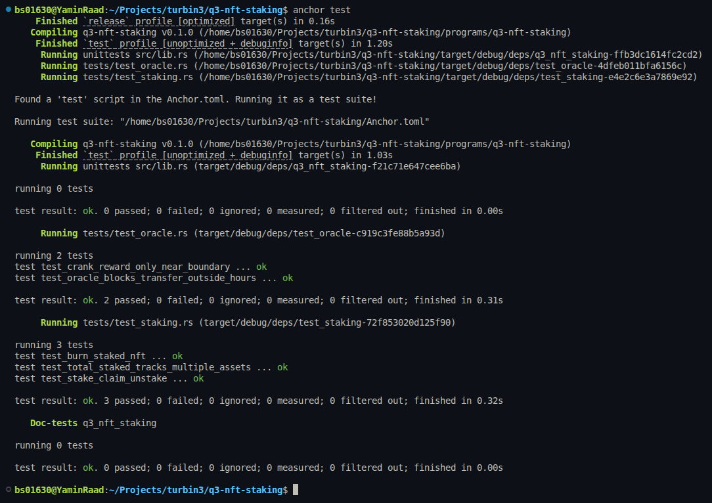

# NFT Staking Core

An Anchor program for staking [Metaplex Core](https://developers.metaplex.com/core) NFTs, built for the Turbin3 Q3 Builders cohort.

- **Task 1 (Core plugins):** stake and unstake with `FreezeDelegate`, claim rewards without unstaking, burn a staked NFT through `BurnDelegate` for a bonus, and keep a `total_staked` counter in the Collection's `Attributes`.
- **Task 2 (Oracle plugin):** an Oracle external plugin allows NFT transfers only from 09:00 to 17:00 UTC. A permissionless crank keeps it up to date and earns a reward. |

## Accounts

| Account          | Seeds                  | Purpose                                                              |
| ---------------- | ---------------------- | -------------------------------------------------------------------- |
| `Config`         | `["config"]`           | Admin, `rewards_per_day`, `burn_bonus`, bumps                        |
| Rewards mint     | `["rewards", config]`  | SPL mint (6 decimals). Its mint authority is `Config`                |
| Update authority | `["update_authority"]` | Collection update authority and delegate for the Freeze/Burn plugins |
| `TransferOracle` | `["oracle"]`           | Oracle validation results that Core reads                            |
| Oracle vault     | `["oracle_vault"]`     | System-owned PDA holding lamports for crank rewards                  |

## Instructions

### Setup (admin only)

| Instruction                               | Description                                                                                          |
| ----------------------------------------- | ---------------------------------------------------------------------------------------------------- |
| `initialize(rewards_per_day, burn_bonus)` | Creates `Config` and the rewards mint                                                                |
| `create_collection(name, uri)`            | Creates a Core collection owned by the update-authority PDA, with the attribute `total_staked = "0"` |
| `mint_nft(name, uri)`                     | Mints a Core asset into the collection for `owner`                                                   |

### Task 1: Staking

| Instruction       | Description                                                                                                                                                                  |
| ----------------- | ---------------------------------------------------------------------------------------------------------------------------------------------------------------------------- |
| `stake`           | Adds a `BurnDelegate` and a frozen `FreezeDelegate`, both delegated to the PDA. Writes the `staked_at` attribute on the asset and increments the collection's `total_staked` |
| `claim_rewards`   | Mints the accrued rewards to the user's ATA and resets `staked_at`. **The NFT stays staked and frozen.** Fails with `NothingToClaim` when nothing has accrued                |
| `unstake`         | Mints the accrued rewards, thaws the asset, removes the Freeze and Burn delegates, clears `staked_at` and decrements `total_staked`                                          |
| `burn_staked_nft` | Mints accrued rewards + `burn_bonus` and decrements `total_staked`. Then it thaws the asset and burns it through the `BurnDelegate` (Core rejects burning a frozen asset)    |

Rewards: `elapsed_seconds * rewards_per_day / 86_400`, in base units of the reward token.

### Task 2: Time-based transfer Oracle

| Instruction                    | Description                                                                                                                    |
| ------------------------------ | ------------------------------------------------------------------------------------------------------------------------------ |
| `create_oracle(vault_deposit)` | Creates the `TransferOracle` with the transfer result for the current time and funds the crank vault                           |
| `add_oracle_plugin`            | Adds the Oracle adapter to the collection: lifecycle `Transfer` only, `REJECT` capability, `ValidationResultsOffset::Anchor`   |
| `crank_oracle`                 | **Permissionless.** Reads the on-chain clock and sets `transfer` to `Pass` during 09:00–17:00 UTC and to `Rejected` outside it |
| `transfer_nft`                 | Calls the Core `TransferV1` CPI, passing the oracle PDA as a remaining account                                                 |

The crank has these rules:

- If the state would not change, the crank fails with `OracleAlreadyUpToDate`.
- The caller earns `CRANK_REWARD_LAMPORTS` (0.01 SOL) only when the state flips within `CRANK_WINDOW_SECS` (5 min) of 09:00 or 17:00.
- A late flip still updates the oracle but pays nothing.
- Staked (frozen) NFTs cannot be transferred at any hour.

## Build and test

```bash
anchor build
anchor test
```

The tests move the clock (`Clock` sysvar) to check reward accrual and the Oracle's open and close boundaries.

### Test results


